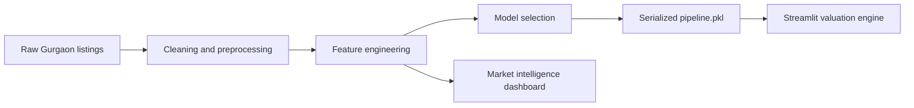

<div align="center">
  

  <br><br>

  

  <p>
    <strong>A luxury-styled Streamlit intelligence suite for Gurgaon property valuation, market exploration, and pricing confidence.</strong>
  </p>

  <p>
    <a href="https://house-prediction-77ywtbegrhhimdh3uvqqqf.streamlit.app/">
      
    </a>
    <a href="https://streamlit.io/">
      
    </a>
    <a href="https://scikit-learn.org/">
      
    </a>
    <a href="https://plotly.com/">
      
    </a>
  </p>

  <h3>
    <a href="https://house-prediction-77ywtbegrhhimdh3uvqqqf.streamlit.app/">Open the deployed app</a>
  </h3>
</div>

---

## Preview

<div align="center">
  <table>
    <tr>
      <td align="center" width="33%">
        
        <br>
        Predicts defensible market value from core property signals.
      </td>
      <td align="center" width="33%">
        
        <br>
        Explores pricing patterns, sectors, distributions, and outliers.
      </td>
      <td align="center" width="33%">
        
        <br>
        Uses custom CSS, premium visuals, and interactive Plotly charts.
      </td>
    </tr>
  </table>
</div>

---

## What It Does

Aurea Estates turns curated Gurgaon housing data into an interactive valuation experience. The app combines a trained scikit-learn pipeline with a polished Streamlit interface so users can estimate property value, inspect market segments, and understand the variables behind price movement.

The experience is designed like a premium real-estate atelier: cinematic hero imagery, gold-accented controls, glass-style panels, animated sections, and dashboard views built for quick scanning.

---

## Core Signals

| Signal | Why It Matters |
|---|---|
| Sector | Captures location premium and neighborhood demand. |
| Property type | Separates flat and house behavior. |
| Bedrooms and bathrooms | Models configuration and livability. |
| Built-up area | Measures scale and usable footprint. |
| Balcony count | Adds amenity and layout context. |
| Age / possession | Reflects readiness, vintage, and construction phase. |
| Servant room / store room | Captures utility and premium inventory markers. |
| Furnishing type | Distinguishes furnished, semi-furnished, and unfurnished properties. |
| Luxury category | Encodes quality tier and finish level. |
| Floor category | Adds floor-position preference and elevation effect. |

---

## Tech Stack

<div align="center">

| Layer | Tools |
|---|---|
| App | Streamlit |
| Modeling | scikit-learn, category-encoders, XGBoost |
| Data | pandas, NumPy |
| Charts | Plotly, Matplotlib, Seaborn |
| Model storage | Git LFS |
| Styling | Custom CSS in Streamlit |

</div>

---

## Repository Map

```text
House Prediction/
├── app.py                         # Main Streamlit valuation dashboard
├── theme.py                       # Design system, styling, and shared UI helpers
├── pages/
│   ├── 1_◈_Market_Intelligence.py # Analytics and market exploration
│   └── 2_◈_The_Guide.py           # Methodology and user guide
├── assets/
│   └── hero_banner.jpg            # README and app hero visual
├── data/
│   ├── raw/                       # Original datasets
│   └── processed/                 # Cleaned datasets used by the app
├── models/
│   ├── df.pkl                     # Supporting serialized data
│   └── pipeline.pkl               # Git LFS model artifact
├── notebooks/                     # EDA, feature engineering, and model training
└── requirements.txt               # Python dependencies
```

---

## Run Locally

Clone the project:

```bash
git clone https://github.com/vyash0048-bit/House-Prediction.git
cd House-Prediction
```

Install Git LFS and fetch the model:

```bash
git lfs install
git lfs pull
```

Create or activate your Python environment, then install dependencies:

```bash
pip install -r requirements.txt
```

Launch the app:

```bash
streamlit run app.py
```

The local app opens at:

```text
http://localhost:8501/
```

---

## Deployment

The app is live here:

<div align="center">
  <a href="https://house-prediction-77ywtbegrhhimdh3uvqqqf.streamlit.app/">
    
  </a>
</div>

`models/pipeline.pkl` is stored with Git LFS because the model is too large for normal GitHub file storage. For deployment, make sure the host pulls LFS files during build.

The app also supports a fallback `MODEL_URL` secret. If the deployed server does not receive the LFS model file, upload `pipeline.pkl` to a direct-download location and set:

```toml
MODEL_URL = "https://your-direct-download-link/pipeline.pkl"
```

---

## Project Flow



---

## Model Notes

The production model is a serialized scikit-learn pipeline. It expects the app inputs to match the training schema exactly, including categorical values such as `furnished`, `semifurnished`, and `unfurnished`.

`requirements.txt` pins `scikit-learn==1.7.2` so the deployed runtime matches the version used to create the model artifact.

---

<div align="center">
  
  <p><em>There is no single market price, only a defensible range. Aurea makes the range visible.</em></p>
</div>
